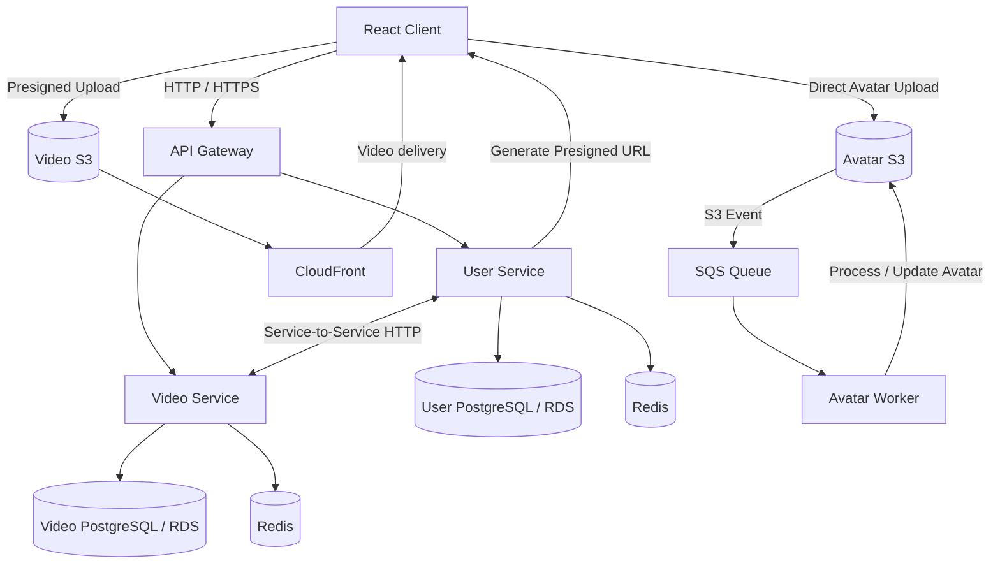

```mermaid
flowchart TD
    Client[React Client] -->|HTTP / HTTPS| Gateway[API Gateway]

    Gateway --> User[User Service]
    Gateway --> Video[Video Service]

    User <-->|Service-to-Service HTTP| Video

    User --> UserDB[(User PostgreSQL / RDS)]
    User --> UserRedis[(Redis)]

    Video --> VideoDB[(Video PostgreSQL / RDS)]
    Video --> VideoRedis[(Redis)]

    %% Video storage
    Client -->|Presigned Upload| VideoS3[(Video S3)]
    VideoS3 --> VideoCDN[CloudFront]
    VideoCDN -->|Video delivery| Client

    %% Avatar processing
    User -->|Generate Presigned URL| Client
    Client -->|Direct Avatar Upload| AvatarS3[(Avatar S3)]
    AvatarS3 -->|S3 Event| SQS[SQS Queue]
    SQS --> Worker[Avatar Worker]
    Worker -->|Process / Update Avatar| AvatarS3
```