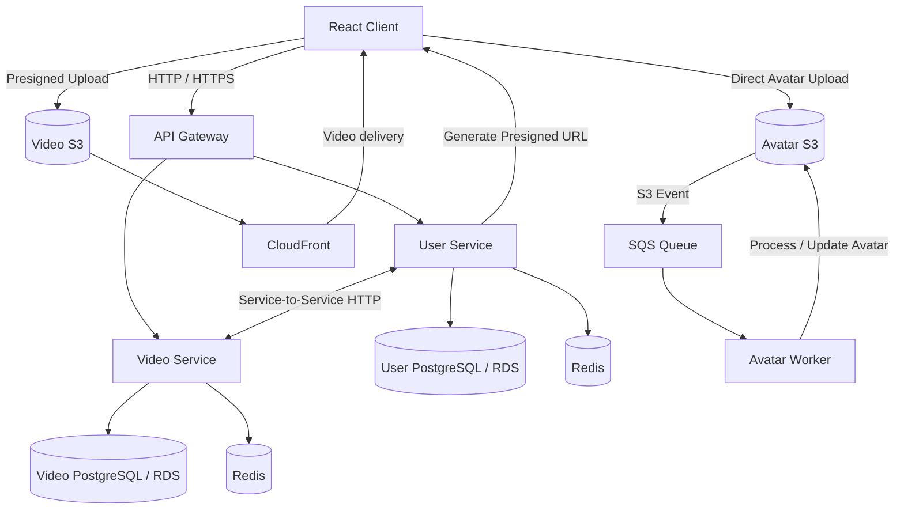

# StreamVibe

StreamVibe is a video-sharing web application built around a microservice-based backend architecture. It supports user authentication, profiles, video uploads, likes, followers, search, user statistics, and asynchronous media processing.

The project was built to explore practical backend architecture concepts including service boundaries, independent data ownership, caching, direct-to-object-storage uploads, asynchronous processing, and cloud deployment.

## Architecture

StreamVibe consists of a React client, an API Gateway, independently deployed backend services, and supporting AWS infrastructure.



The API Gateway provides the public backend entry point and routes requests to the appropriate service.

Each service owns its data. Services do not access another service's database directly; cross-domain information is obtained through service-to-service APIs.

Media files are uploaded directly from the client to Amazon S3 using presigned URLs, avoiding unnecessary file transfer through backend servers.

Avatar processing is asynchronous: uploading an avatar to S3 produces an event that is delivered through SQS and consumed by a dedicated worker.

## Tech Stack

### Frontend

* React
* Vite
* TanStack Router

### Backend

* Node.js
* Express
* PostgreSQL
* Redis
* JWT authentication
* bcrypt

### Infrastructure

* AWS EC2
* Amazon RDS
* Amazon S3
* Amazon CloudFront
* Amazon SQS
* Docker
* Docker Compose

## Services

### API Gateway

The API Gateway acts as the public entry point for backend requests.

Its responsibilities include:

* routing requests to backend services
* providing a single API endpoint for the frontend
* isolating internal services from direct public access

### User Service

Responsible for the user domain.

Main functionality:

* registration and authentication
* JWT-based authorization
* user profiles
* avatar uploads
* followers
* user search
* user statistics

The service owns its PostgreSQL database and uses Redis to cache frequently requested data.

When information owned by another domain is required, the User Service communicates with the corresponding service through its API instead of accessing its database directly.

### Video Service

Responsible for the video domain.

Main functionality:

* video creation and deletion
* video metadata
* video uploads
* likes
* like status
* view statistics
* presigned S3 upload URLs

The Video Service owns a separate PostgreSQL database and uses Redis for caching.

### Avatar Worker

Avatar processing is performed asynchronously by a dedicated worker.

The upload flow is:

1. The client requests a presigned upload URL.
2. The User Service generates the URL.
3. The client uploads the avatar directly to S3.
4. S3 generates an object-created event.
5. The event is delivered to an SQS queue.
6. The Avatar Worker consumes the message.
7. The worker processes the uploaded avatar.
8. The processed result is stored in S3.

This keeps CPU-intensive or potentially slow media processing outside the HTTP request lifecycle.

## Data Ownership

StreamVibe follows a database-per-service approach.

```text
User Service  ──► User Database
Video Service ──► Video Database
```

A service never queries another service's database directly.

For example:

```text
User Service ──HTTP──► Video Service ──► Video Database
```

This keeps domain ownership explicit and reduces coupling between services.

## Caching

Redis is used to reduce repeated database queries for frequently requested data.

Cached data uses short TTLs and is invalidated when the underlying resource changes.

This allows the application to improve read performance without treating the cache as the authoritative source of data.

## Media Storage

Large media files are not transferred through the application servers.

Instead, the backend generates presigned S3 URLs and the browser uploads files directly to object storage.

```text
Client ──► Backend
       request presigned URL

Client ──────────────► S3
       direct upload
```

Video content stored in S3 can be delivered to clients through CloudFront.

This design reduces backend bandwidth usage and separates media storage from application logic.

## API

The backend exposes APIs for authentication, users, profiles, followers, videos, likes, uploads, and statistics.

Example routes include:

```text
/api/auth
/api/users
/api/users/:id/profile
/api/users/:id/stats
/api/videos
/api/videos/:id
```

Internal service-to-service APIs are used when one domain requires information owned by another service.

## Deployment

The backend components are containerized using Docker.

The production architecture uses AWS infrastructure, including:

```text
EC2          Application services
RDS          PostgreSQL databases
S3           Media/object storage
CloudFront   Media delivery
SQS          Asynchronous event delivery
Redis        Application caching
```

The API Gateway, User Service, and Video Service can be deployed independently, allowing individual components to evolve without requiring the entire backend to be deployed as a single application.

## Local Development

### Requirements

Make sure the following tools are installed:

* Node.js
* Docker
* Docker Compose
* Git

### Clone the repository

```bash
git clone <repository-url>
cd StreamVibe
```

### Environment variables

Create local `.env` files from the provided examples.

```bash
cp .env.example .env
```

Do not commit real credentials or secrets to the repository.

Typical configuration includes:

```env
DATABASE_URL=
REDIS_URL=
JWT_SECRET=

AWS_REGION=
S3_BUCKET=
SQS_QUEUE_URL=
```

Refer to `.env.example` for the complete list of required variables.

### Start the application

```bash
docker compose up --build
```

## Project Goals

StreamVibe was created as a practical exploration of backend and distributed-system concepts rather than only as a CRUD application.

The project focuses on:

* microservice boundaries
* database ownership
* service-to-service communication
* caching and cache invalidation
* asynchronous processing
* direct-to-S3 uploads
* cloud infrastructure
* containerized deployment

## Security

Sensitive configuration is provided through environment variables and is excluded from version control.

Passwords are hashed before storage, and authenticated API access uses JWT-based authorization.

AWS credentials, database passwords, JWT secrets, and other sensitive values must never be committed to the repository.

## Documentation

More detailed technical documentation is available in:

* [Architecture](./ARCHITECTURE.md)

## License

This project is intended primarily for educational and portfolio purposes.


